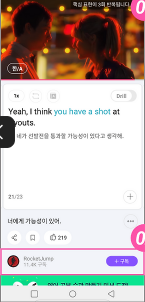

<div align="center">

# 🎬 YouTube English Tutor

**Learn English from any YouTube video.**
Dictation, shadowing, and writing practice — with an AI tutor that tracks your progress

<br/>


**English** · [한국어](./README.ko.md)

</div>

---

## ✨ Features

| | |
|---|---|
| 🎧 **Listen** | Dictation with sentence-level replay of video captions |
| 🎙️ **Speak** | Shadowing with your mic — AI compares your speech to the native audio |
| ✍️ **Write** | AI-generated composition tasks built from expressions in the video |
| 🤖 **AI Agent** | Chat tutor that registers videos, reviews your history, and suggests what's next |
| 📊 **Dashboard** | Study streak, per-mode average scores, and 14-day activity |

## 📸 Screenshots

<div align="center">

&nbsp;&nbsp;&nbsp;

</div>

## 🚀 Quick start (Docker)

```bash
cp .env.example .env        # then open .env and paste your GROQ_API_KEY
docker compose up           # or: docker compose up -d   (run in the background)
```

Open **http://localhost:8080**. That's it — the frontend, backend, and reverse proxy
are wired together automatically, and your data persists in a Docker volume.
The first run builds the images (a few minutes); later runs start in seconds.

> Stop with `Ctrl+C` (foreground) or `docker compose down` (background).

## 📱 View it on your phone

`localhost` works with the microphone on your own machine, but a phone reaching your
computer over the LAN is **not** a secure context, so mic/speech features (Speak mode,
text-to-speech) are blocked over plain HTTP. Put an HTTPS tunnel in front of port 8080:

```bash
ngrok http 8080                              # https://ngrok.com
# or
cloudflared tunnel --url http://localhost:8080   # no account needed for a quick URL
```

Open the `https://…` URL it prints on your phone.

## 🛠️ Manual setup (without Docker)

<details>

```bash
# 1) env
cp .env.example .env         # add your GROQ_API_KEY

# 2) backend  → http://localhost:8000  (API docs at /docs)
cd backend
python -m venv venv && source venv/bin/activate   # Windows: venv\Scripts\activate
pip install -r requirements.txt
uvicorn main:app --reload

# 3) frontend → http://localhost:3000  (in a second terminal)
cd frontend
npm install
npm run dev
```

Requires Node.js 18+ and Python 3.10+.

</details>

## ⚙️ Environment variables

All variables live in a single root `.env` (copy from `.env.example`).

| Variable | Required | Default | Purpose |
|---|:---:|---|---|
| `GROQ_API_KEY` | ✅ | — | Whisper (STT) + Llama (LLM) for grading and the agent |
| `YOUTUBE_API_KEY` | — | *(fallback)* | Video title/thumbnail metadata; captions work without it |
| `DATABASE_URL` | — | `sqlite:///./app.db` | Database location |
| `CORS_ALLOW_ORIGINS` | — | `http://localhost:3000` | Allowed frontend origins (manual setup) |
| `GROQ_TIMEOUT` | — | `30` | Per-call Groq timeout (seconds) |
| `GROQ_MAX_RETRIES` | — | `3` | Groq retry count on rate limits |
| `LOG_LEVEL` | — | `INFO` | Log verbosity |

> Get a free Groq API key at **[console.groq.com/keys](https://console.groq.com/keys)**.

## 🧱 Tech stack

- **Frontend** — Next.js (App Router), TypeScript, Tailwind CSS
- **Backend** — FastAPI, SQLAlchemy, SQLite
- **AI** — Groq (Whisper STT + Llama), a ReAct-style tool-using agent
- **Captions** — youtube-transcript-api

## 📄 License

[MIT](./LICENSE)
